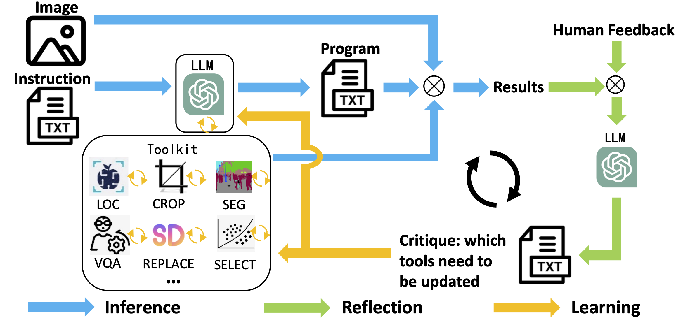
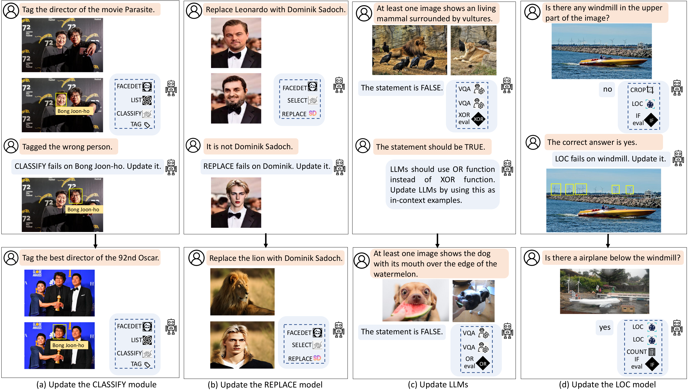

#  CLOVA: A Closed-Loop Visual Assistant with Tool Usage and Update (CVPR 2024)

[Zhi Gao](https://zhigao2017.github.io/), [Yuntao Du](https://yuntaodu.github.io/), [Xintong Zhang](https://github.com/ZhXTong), [Xiaojian Ma](https://jeasinema.github.io), [Wenjuan Han](https://github.com/cocacola-lab), [Song-Chun Zhu](https://zhusongchun.net/), [Qing Li](https://liqing-ustc.github.io/)


[ [Project Page](https://clova-tool.github.io/) | [Arxiv Paper](https://arxiv.org/abs/2312.10908)  ]

This is the official code for CLOVA - a Closed-Loop Visual Assistant that can update used tools via a closed-loop framework with inference, reflection, and learning phases.


# Framework



# Install Dependencies
```
conda env create -f environment.yml
conda activate clova
```

# Config

Our method requires one A100 GPU. 

- The config file for LLMs and tasks: [`configs/LLM_config.yaml`](configs/LLM_config.yaml)
- The config file for tools: [`configs/all_updated_model_config.yaml`](configs/all_updated_model_config.yaml)
 
We use LLaMA2-7B for inference and reflection, and you can also try other LLMs, such as GPT-3.5-turbo.
We use GPT-3.5-turbo for the LIST tool and collecting images from the Internet. You can revise your api key in the config file [`configs/LLM_config.yaml`](configs/LLM_config.yaml).

# Dataset

### GQA
Download the GQA dataset from [GQA Link](https://cs.stanford.edu/people/dorarad/gqa/download.html), and revise the path in [`configs/LLM_config.yaml`](configs/LLM_config.yaml). The GQA dataset is used for the compositional VQA task.


### NLVRv2

Download the NLVRv2 dataset from [NLVRv2 Link](https://lil.nlp.cornell.edu/nlvr/), and revise the path in [`configs/LLM_config.yaml`](configs/LLM_config.yaml). The NLVRv2 dataset is used for the multiple-image reasoning task.

### LIVS
Download the LIVS dataset from [LIVS Link](https://www.lvisdataset.org/), and revise the path in [`configs/all_updated_model_config.yaml`](configs/all_updated_model_config.yaml) for the LOC and SEG tools. The LVIS dataset is used as an open-vocabulary dataset to update the two tools.

# Running the Demo
We provide four demos for the VQA, mutliple image reasoning, image editing, and knowledge tagging tasks.


For the VQA task
```
python -m torch.distributed.launch --nproc_per_node=1 gqa_demo.py
```

For the multiple image reasoning task
```
python -m torch.distributed.launch --nproc_per_node=1 nlvr_demo.py
```


For the image editing task
```
python -m torch.distributed.launch --nproc_per_node=1 imgedit_demo.py
```


For the knowledge tagging task
```
python -m torch.distributed.launch --nproc_per_node=1 knowtag_demo.py
```


# Adding New Tools

- If the tool is learnable (e.g., a neural network), you should add a separate python file in the `tools` folder, including a class of this tool with `execute` and `update` functions. Following is an exmaple of the LOC tool.
```
class LocInterpreter():
    step_name = 'LOC'
    def __init__(self):
       ...
    def parse(self,prog_step):
       ...       
    def execute(self, prog_step):
       ...
    def update(self, query):
       ...       
    
```


- If the tool is not learnable, you should add a class in `tools/unupdated_functions.py', including `parse' and `execute' functions. Following is an exmaple of the COUNT tool.
```
class CountInterpreter():
    step_name = 'COUNT'
    def __init__(self):
       ...

    def parse(self,prog_step):
       ...

    def execute(self,prog_step,inspect=False):
       ...
```

- Add tool instruction to the `prompt_engineering.py` file, and several in-context examples to corresponding `experience_pool.py` file in the `prompts` folders.


# What CLOVA Can Do

It can update used tools based on human feedback.




# Contact

zhi.gao@pku.edu.cn, gaozhi_2017@126.com


# Acknowledgement

We thank the following codebases.

+ [VISPROG](https://github.com/allenai/visprog) The architecture of our code is based on VISPROG (CVPR2023 best paper). Don't forget to check this great open-source work if you don't know it before!
+ [BLIP](https://github.com/salesforce/BLIP) Our prompt tuning scheme is evaluated and developed firstly on the BLIP code.
+ [Textual Inversion](https://github.com/rinongal/textual_inversion) The prompt tuning scheme for Stable Diffusion is based on Textual Inversion.
 


# Citation
If you find this code useful in your research, please consider citing:
```
@inproceedings{gao2024clova,
  title={CLOVA: A closed-loop visual assistant with tool usage and update},
  author={Gao, Zhi and Du, Yuntao and Zhang, Xintong and Ma, Xiaojian and Han, Wenjuan and Zhu, Song-Chun and Li, Qing},
  booktitle={Proceedings of the IEEE/CVF conference on computer vision and pattern recognition (CVPR)},
  year={2024}
}
```
